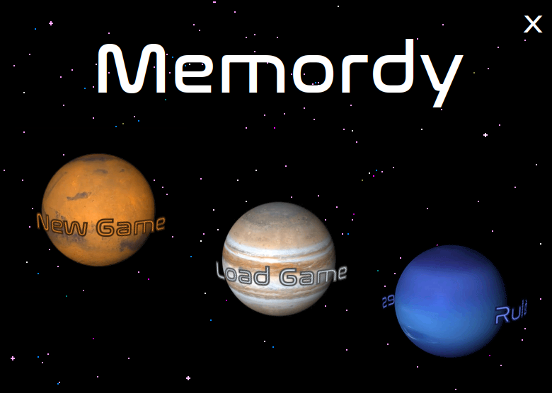
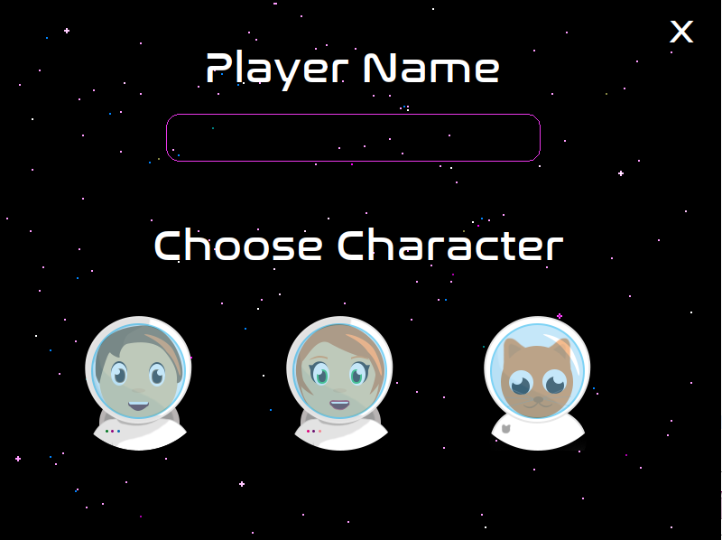
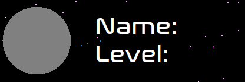
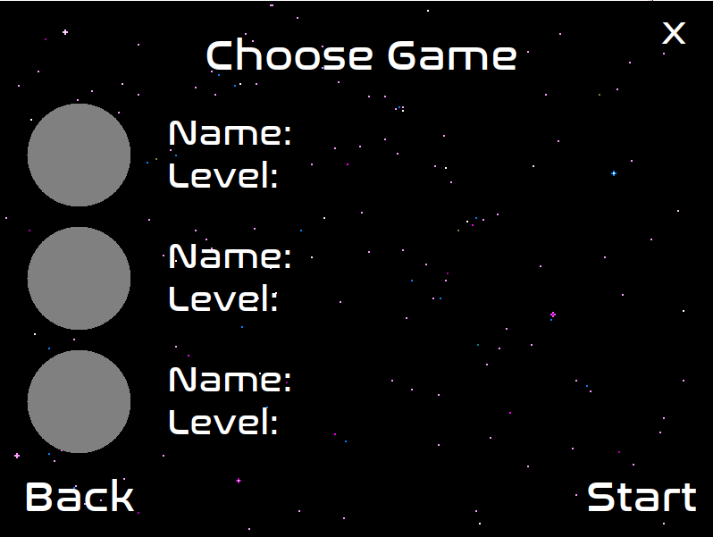

# Memordy

**Memory Word Game**
-Mini Proyect 3 for my interactive programming class in U.

## Day 1 🤗
Creating the Main Menu GUI. Added a component that changes images sizes, even gifs keeping their animation. 

[Image Resize Component](https://github.com/Ingrid-E/Memory_Word_Game/blob/main/MemordyComponents/src/components/ImageResize.java) 😄

------------

Added Font [Nazalization](http://typodermicfonts.com/)

Added Title and Buttons. 

**Trying to add only one mouse, text, listener class.**

------------
- [ x ] Finish New Game GUI.

## Day 2 

Almost Finished with NewGameGui.
- [ x ] Add back to main menu button.
- [ x ] Add next button

Still haven't added file reading, leaving that for the end.

Added Characters to the game.

------------

Put exit and background elements in constructor so it can be reused just by calling it.
**Removed JFrame decoration, and added MouseMotion to move the window with mouse clicking anywhere.**

Finished look for today:

## Day 3 

Added Next and Back button to allow player navigate around the game.

Fixed and error that made listener not work.

Finished load game GUI.
-[  ] Add Player Object.

###Created a new component

[Choose Saved Game](#)

Shows player icon (Without save it's a grey icon), name and level. 
Needs a player object to get name, and current level, will create another 
constructor when i have created this object.

------------

###Load Game GUI Look

